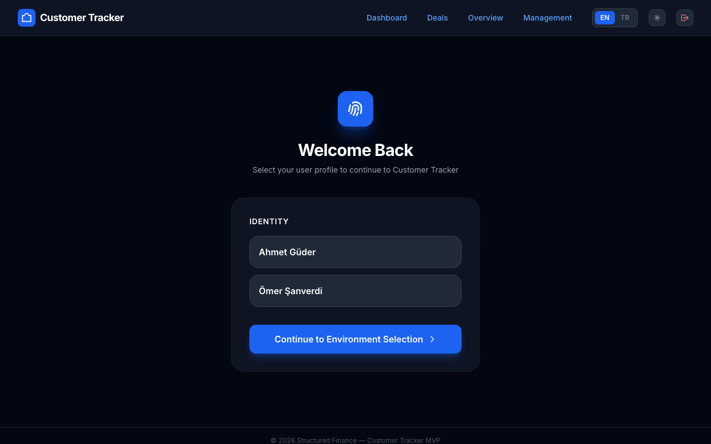
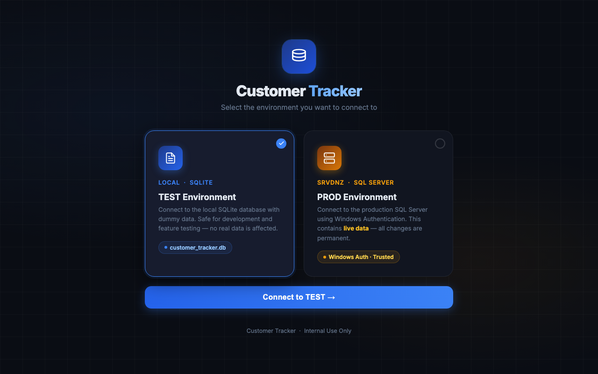
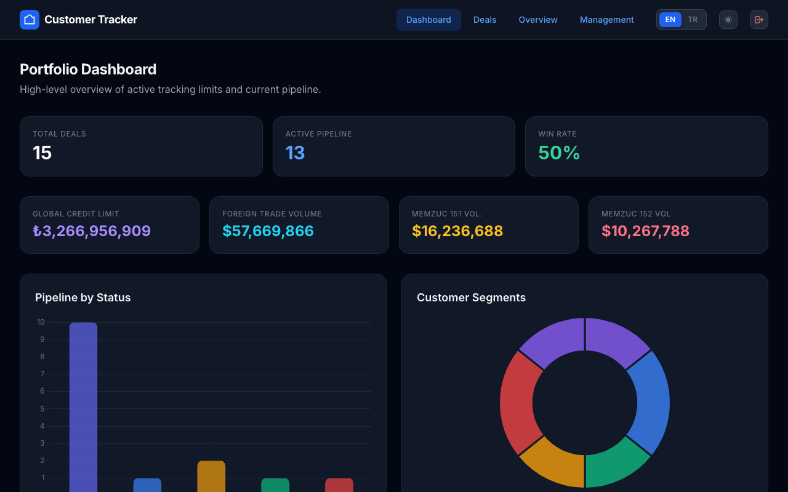
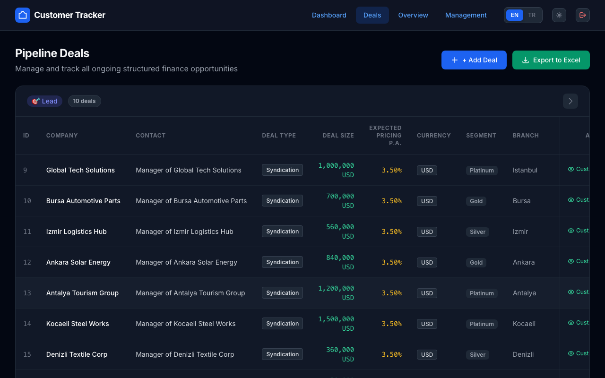
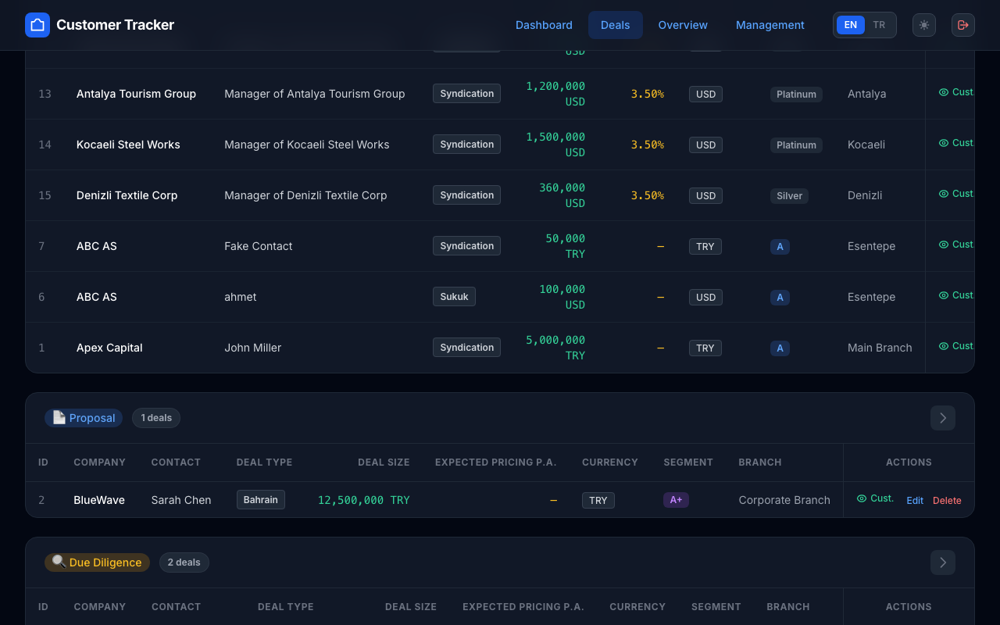
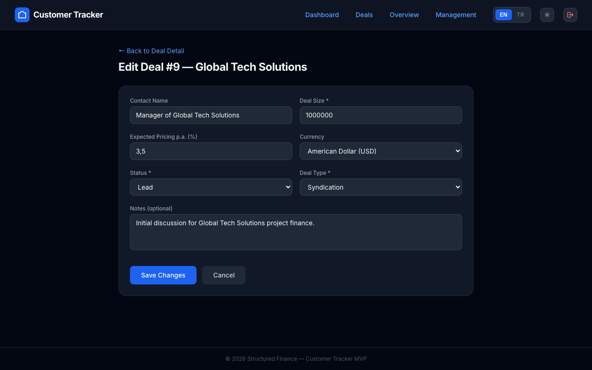
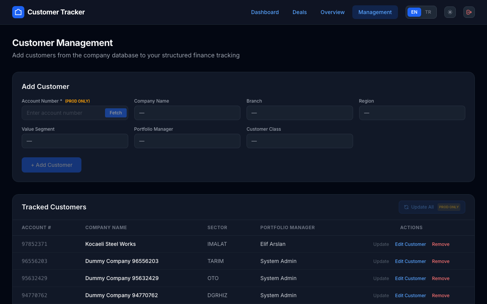
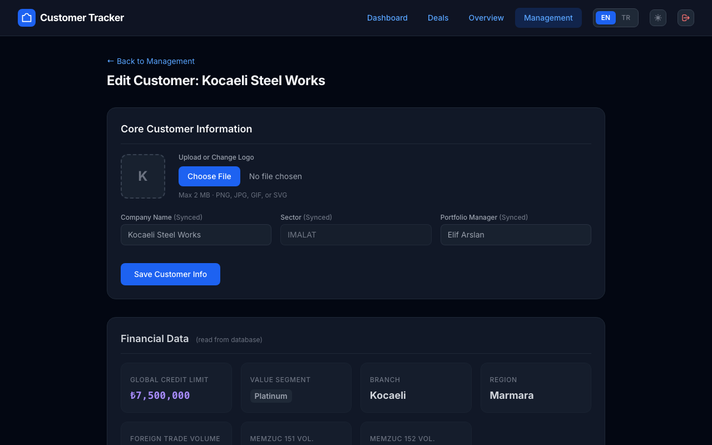
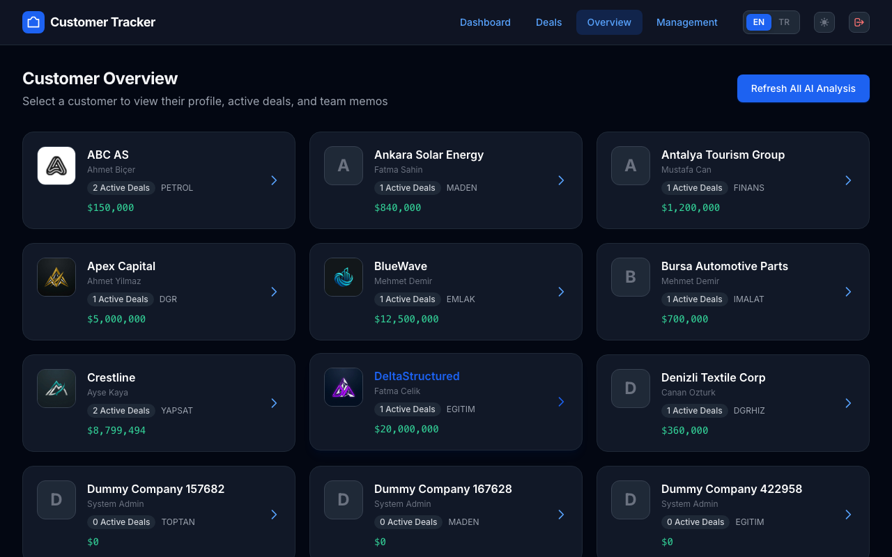
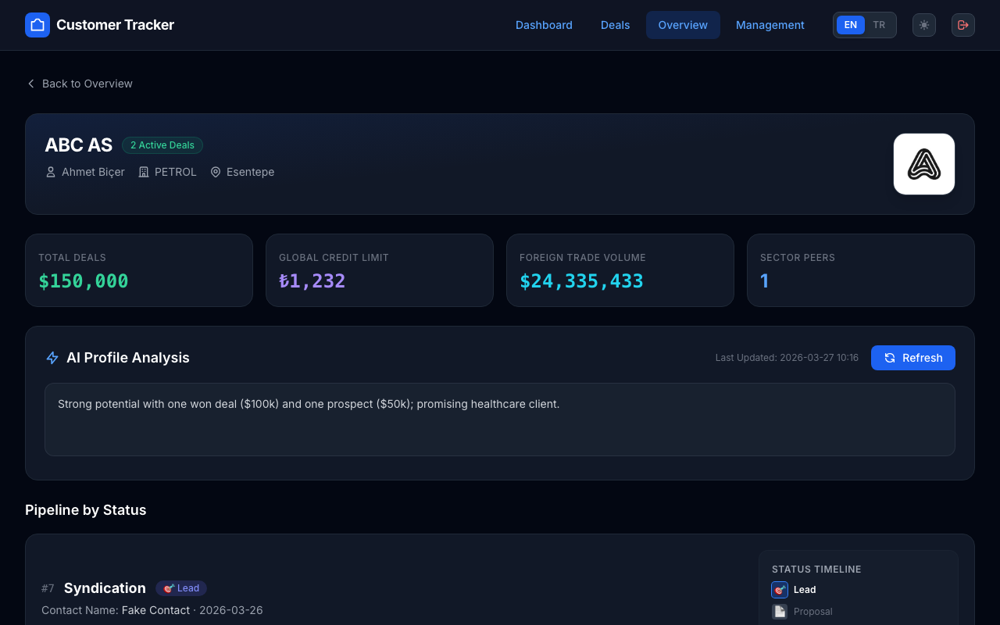

# Customer Tracker: Technical Architecture & Onboarding

Welcome to the **Customer Tracker** application. This document serves as a comprehensive onboarding guide for new developers working on the codebase. It details the system architecture, how the code is structured, the technical details of both test and production environments, and a visual walkthrough of the key application pages.

---

## 1. Core Tech Stack
- **Backend Framework:** Python Flask
- **Templating Engine:** Jinja2
- **Styling Strategy:** Vanilla CSS along with Tailwind CSS (utility classes used throughout templates)
- **Database (Test):** SQLite3 (`customer_tracker.db`)
- **Database (Prod):** Microsoft SQL Server (`pyodbc` Driver)
- **External API/AI capabilities:** Integrates with `Ollama` locally (`qwen3-coder:30b`) for analyzing customer records and chatbot features.

---

## 2. Directory Structure

The repository is structured to separate concerns:

- `app.py`: The single-file Flask application containing all routes, configuration, database wrapper abstractions, and API bindings.
- `queries/`: A folder containing pure `.sql` query files. All SQL parsing occurs here dynamically via `load_query()`, separating SQL logic from python control flow.
- `templates/`: HTML Jinja2 templates extending a common layout (`base.html`).
- `static/`: Contains images, logos, CSS (`style.css`), and generic client assets. Logo uploads correspond exactly to specific customers via secure hashing rules.
- `customer_tracker.db`: Local SQLite database containing dummy testing state.

---

## 3. Architecture & Functional Designs

### 3.1 Environments (TEST vs. PROD)
The application has a robust environment mechanism enabling developers and users to view dummy data vs real banking data. 
- **TEST**: Operates exclusively over the local SQLite DB (`customer_tracker.db`) enabling rapid iteration without VPN or enterprise credentials.
- **PROD**: Automatically connects via `pyodbc` to `SRVDNZ` (SQL server DB). 

A unique **DbConnection Abstraction Module** in `app.py` standardizes API interaction for both `sqlite3` and `pyodbc`, providing a `.fetchall()` and `.fetchone()` abstraction so you can switch environments using the same route codebase safely. 

### 3.2 View & Guard Routing 
The app utilizes strict `@app.before_request` guards. A user must:
1. Select an identity (`session['user_id']`).
2. Select an environment (`session['env']` as `test` or `prod`).

If these are not present, users are actively redirected out of secure pages.

### 3.3 Dynamic Query Engine
Instead of writing inline SQL or using heavy ORMs like SQLAlchemy, the app utilizes raw SQL from the `/queries` folder (`load_query("name.sql")`). This gives the power of pure SQL execution without the mess. 

---

## 4. Visual Application Walkthrough

*(Screenshots referenced below are captured and organized within the `/photos` folder).*

### 1. Identity Verification (`/user-login`)
The entry point. Users verify their identity here which establishes the `user_id` session.



### 2. Context Selection (`/env-login`)
Forces the user to choose their operational context. Choosing PROD will validate ODBC connections before proceeding.



### 3. Global Dashboard (`/dashboard`)
Provides an aggregate look at portfolio data. Utilizes parameters fetched securely from the DB. Information is split dynamically based on value segments, volume totals, and geographic regions.



### 4. Deals Pipeline / Tracker (`/list`)
A CRUD tracker that gives visibility into all currently tracked deals. Users can export this directly to a Microsoft Excel (`.xlsx`) via the `/list/export` route utilizing `openpyxl`.




### 5. Detailed Deal Overview
A specific subset of Deal information displaying metrics, contacts, expected limits, and related metadata.



### 6. Customer Management (`/management`)
An administration zone used to edit top-level metadata or "Sync" internal database structures with externally sourced records.



### 7. Editing Customers
The system utilizes active mapping properties allowing users to adjust logos, managers, and segment data individually.



### 8. Global Portfolio View (`/overview`)
Different from the Deals list, this page gives a top-down view of all onboarded Customers linked to the current user's visibility.



### 9. AI-Assisted Customer Overview Detail (`/overview/<id>`)
Displays deep contextual details regarding a specific customer's aggregate records. Employs `qwen3-coder:30b` to yield descriptive analytics directly based on internal properties.




---

## 5. Getting Started & Running Locally

To build on this foundation:

1. **Virtual Environment Setup (Recommended):**
   ```bash
   python3 -m venv .venv
   source .venv/bin/activate
   pip install -r requirements.txt
   ```
   *(Note: The `pyodbc` requirement may fail if you lack the Microsoft ODBC driver externally. Omit it if you only intend to develop under the `Test` constraint.)*

2. **Starting the Development Server:**
   ```bash
   python app.py
   # Runs on http://127.0.0.1:5000
   ```

3. **Modifying SQL:**
   If you need to change data-fetching logic, search the `queries/` directory instead of `app.py`. Modify `.sql` files directly.

4. **Enhancing AI capabilities:**
   Review `api/analysis/generate` and `api/chat`. The endpoints post locally to `http://localhost:11434/api/generate` (Ollama). Adjust `prompt_en.txt` and `prompt_tr.txt` in the root folder to fine-tune AI logic.

Good luck continuing development on the Customer Tracker!
