# Customer Tracker — UI Introduction

> **Application**: Customer Tracker  
> **Domain**: Structured Finance — Deal Pipeline Management  
> **Stack**: Python / Flask / SQL Server / Jinja2  
> **Design System**: Industrial Minimalism (dark mode, monospace headers, 0px radius, 1px grid borders)

---

## Design System Overview

| Token | Value |
|-------|-------|
| **Primary** | `#2f6fdb` (Blue) |
| **Secondary** | `#7bdb87` (Green) |
| **Background** | `#0a0f1a` |
| **Surface** | `#111827` |
| **Border** | `#1e293b` |
| **Font – Headings** | Inter, 600–700 weight, uppercase, letter-spacing 0.06em |
| **Font – Data** | JetBrains Mono, monospace |
| **Border Radius** | 0px (zero radius everywhere) |
| **Layout** | 256px fixed sidebar · 48px top bar · 36px tab bar · 32px status footer |

---

## 1. Authentication — User Login

Full-screen, centered login card on a dark grid background. No sidebar or navigation is shown. Users select their profile from a radio list and click **INITIALIZE_SESSION**.

**Key elements**: Terminal-style brand header, profile radio cards, blue CTA button, LED status footer ("SYS_ONLINE").

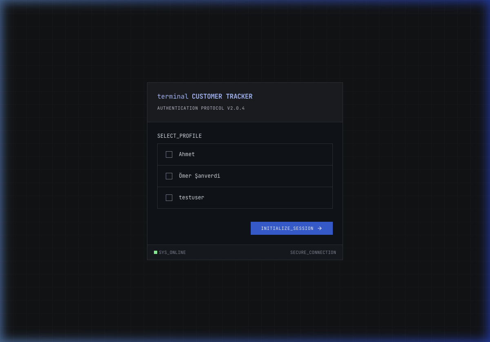

---

## 2. Authentication — Environment Selection

After user selection, a second full-screen step prompts the user to choose between **LOCAL** (dev/test) and **PROD** (production) database environments. Each environment is presented as a selectable card with metadata (server address, description, badge).

**Key elements**: Two side-by-side environment cards with checkbox indicator, color-coded badges (blue "DEV" vs red "WIN AUTH"), dynamic connect button text.

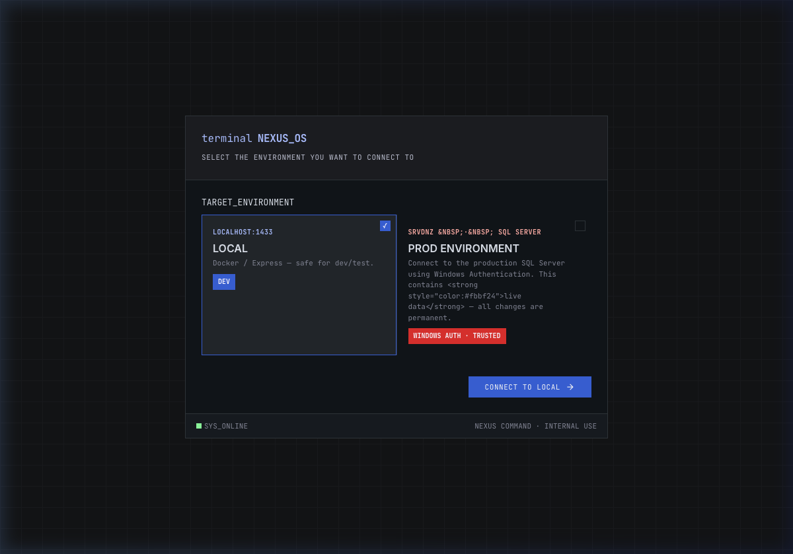

---

## 3. Dashboard (Home)

The primary landing page after login. Displays a high-level portfolio overview with KPI summary cards at the top, followed by Chart.js visualizations.

**Layout**: 
- **Top row**: 3 KPI cards (Total Deals, Active Pipeline, Win Rate)
- **Second row**: 4 metric cards (Global Credit Limit, Foreign Trade Volume, two custom volume fields)
- **Charts**: Pipeline by Status (bar), Customer Segments (doughnut), Regional Distribution (bar)
- **Bottom**: AI Compliance Chatbot (RAG-powered, streaming responses)

**Navigation**: 256px vertical sidebar on the left with 8 navigation items. 36px tab bar below the top bar shows open pages as browser-style tabs.

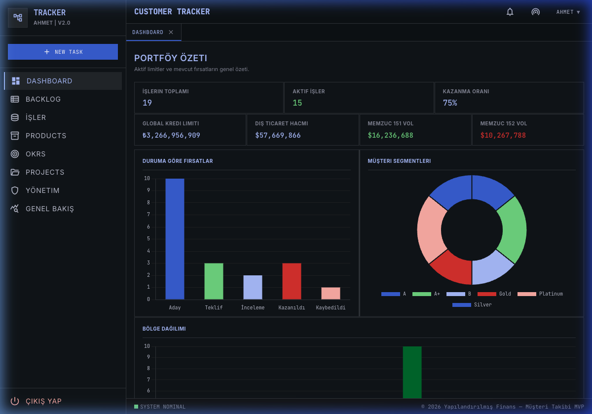

---

## 4. Backlog

A global work-item tracker showing all open tasks across deals and projects. Features inline filter dropdowns for Type, Status, Assignee, and Deadline.

**Layout**: Filterable data table with columns: Title/Descriptor, Deal/Flow, Type (badge), Status (LED indicator), Deadline. Each row shows the task name, description, and assigned user.

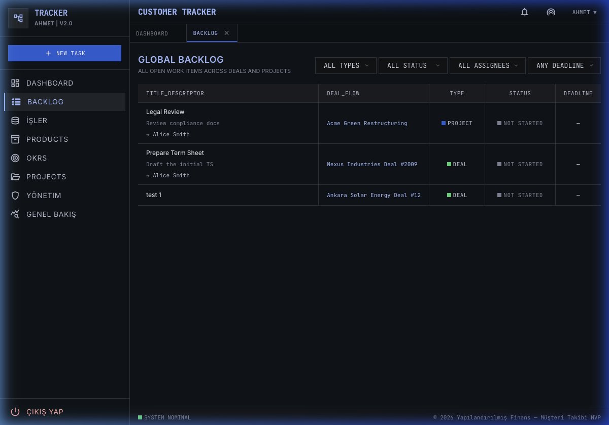

---

## 5. Deals — Pipeline List

The core deal pipeline view, grouped by deal stage. Each stage is a collapsible section (Lead, Proposal, Due Diligence, Closed Won, Closed Lost) with a row count badge.

**Layout**: Grouped data tables with columns: ID, Company (clickable link), Contact, Deal Type, Deal Size (color-coded currency), Expected Pricing. Action buttons for adding new deals and exporting to Excel.

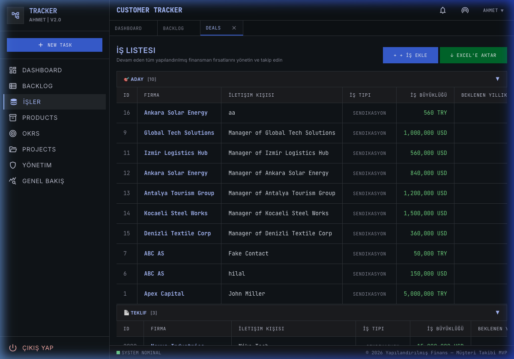

---

## 6. Deal Detail

Clicking a deal row navigates into the deal detail view inside the same tab. Shows all deal metadata in a structured card layout.

**Layout**:
- **Header**: Deal ID, type badge, status badge, company and contact info
- **Metrics grid**: Deal Size, Pricing P.A., Currency, Sector
- **Second grid**: Credit Limit, Segment (color badge), Branch, Region, Foreign Trade
- **Left panel**: Deal Notes with Edit/Delete buttons
- **Right panel**: Status Timeline showing the 5-stage pipeline progression with icons
- **Bottom**: Deal Backlog showing task items with completion checkboxes

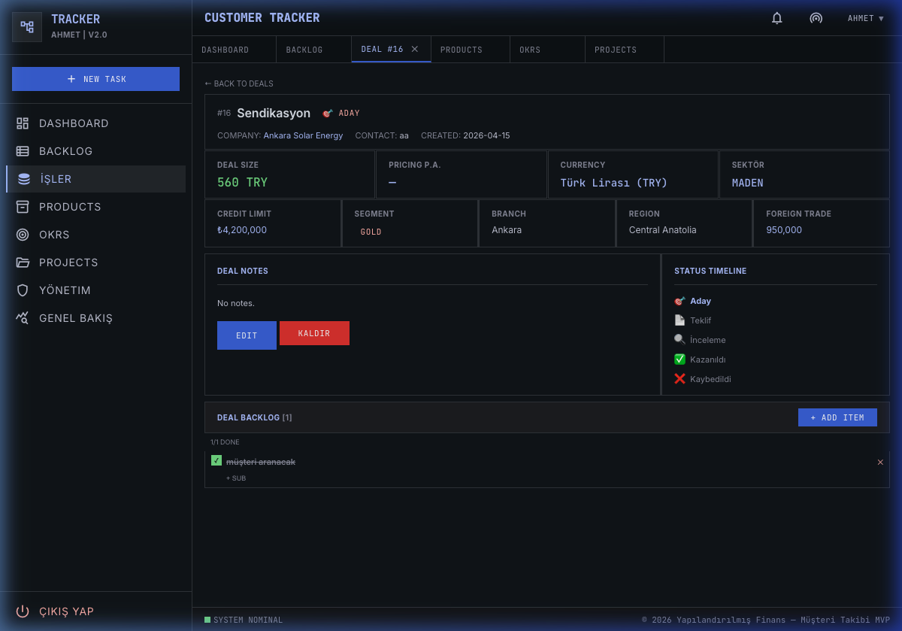

---

## 7. Products

A catalog of financing products available to structure deals. Each product has a code, type classification, contract info, and a count of linked deals.

**Layout**: Simple data table with columns: Product (clickable), Code, Type (badge), Contract, Partner, Deals count, and a navigation arrow. Blue CTA button "+ ADD PRODUCT" in the header.

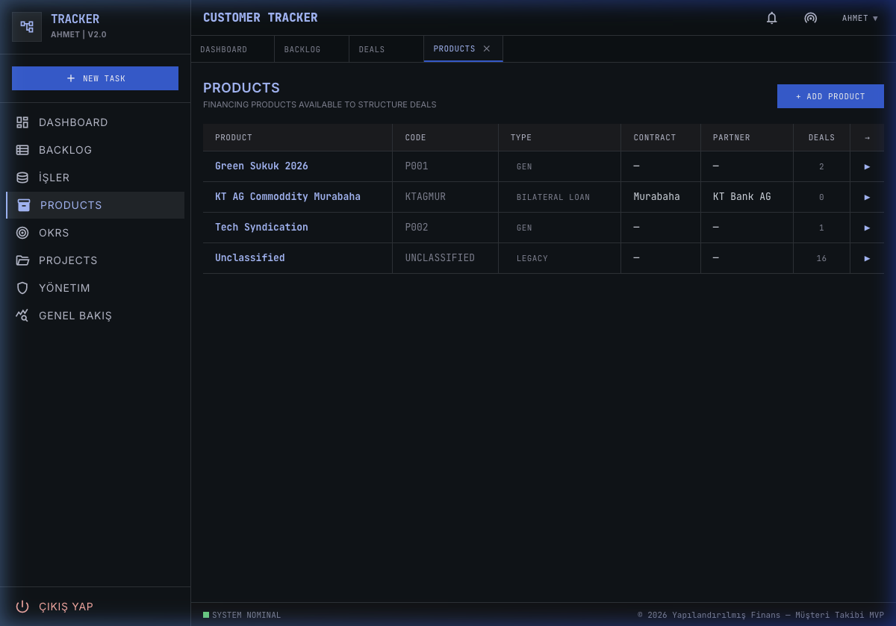

---

## 8. Product Detail

Detailed view for a single financing product, showing its configuration and all linked deals.

**Layout**: Product metadata card at the top (name, code, type, contract, partner), followed by a "Linked Deals" table showing all deals using this product.

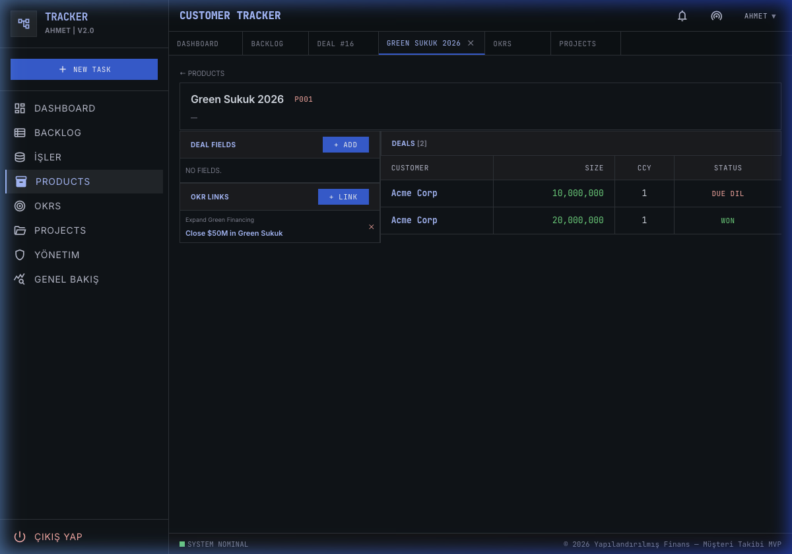

---

## 9. OKRs (Objectives & Key Results)

Strategic goal tracking with nested objective → key result hierarchy. Each objective is an expandable card containing its key results with progress indicators.

**Layout**: Accordion-style cards. Each objective shows title, description, and status. Key results are listed below with measurable targets and current values.

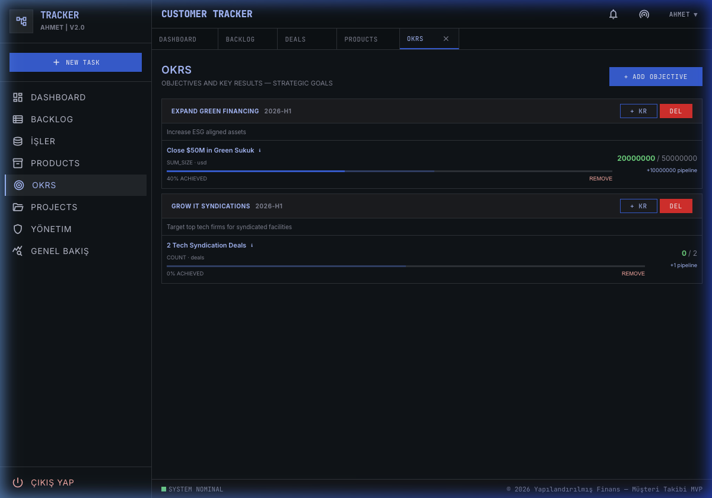

---

## 10. Projects

Cross-deal project management view. Shows project cards with metadata, timelines, and assignment info.

**Layout**: Data table/card list with project name, description, status, assigned team, and timeline. Click-through to project detail pages.

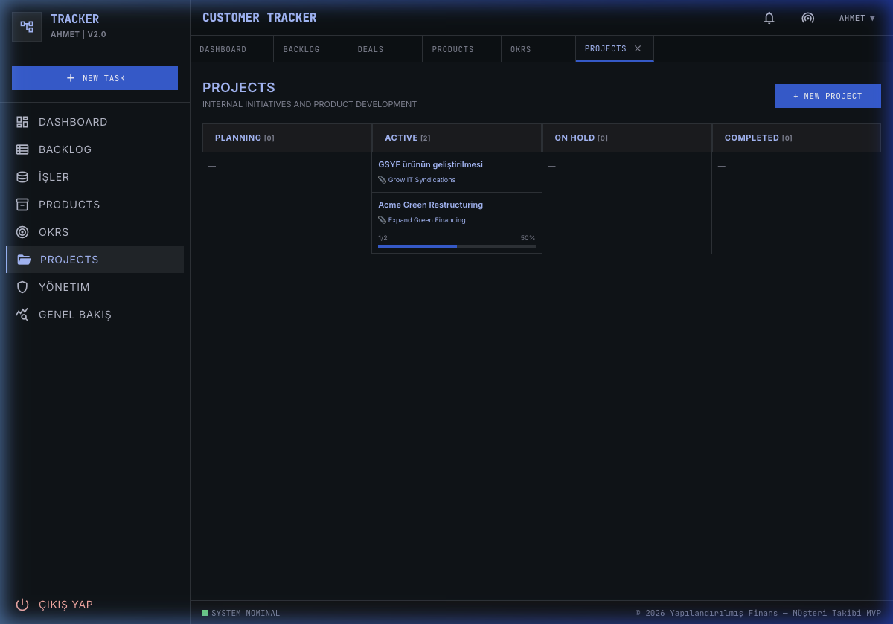

---

## 11. Browser-Style Tab System

Pages open as browser-style tabs. Clicking sidebar items opens new tabs; re-clicking activates the existing tab (no duplicates). Tabs support:
- **Close button** (× icon, appears on hover)
- **Right-click context menu** with "Close Tab", "Close Other Tabs", "Close All Tabs"
- **Busy tab protection**: Closing a tab during active processing (e.g. chatbot streaming) shows a warning modal

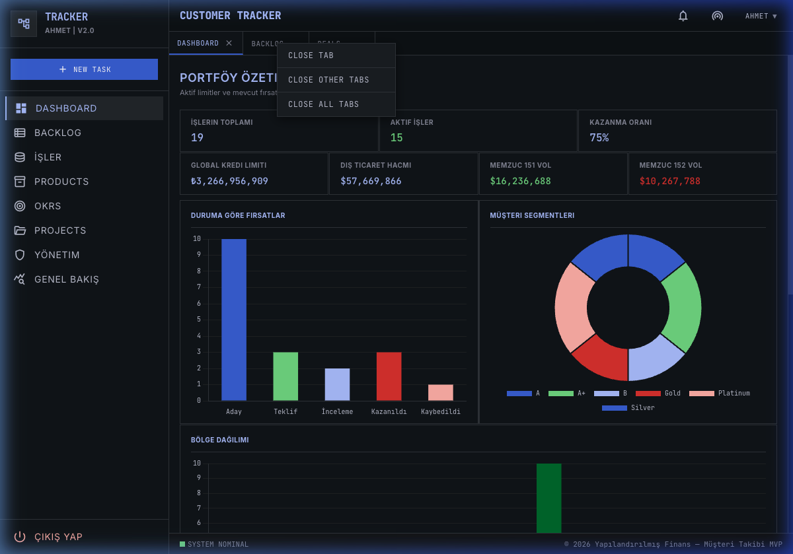

---

## Persistent UI Elements

| Element | Description |
|---------|-------------|
| **Sidebar** | 256px fixed left panel with 8 nav items + sign-out link. Active page highlighted with blue left border and background. |
| **Top Bar** | 48px header with "CUSTOMER TRACKER" brand, notification/network icons, and user dropdown (language switcher + sign out). |
| **Tab Bar** | 36px browser-style tab strip. Tabs show page name in uppercase monospace, with × close and spinner for busy pages. |
| **Status Footer** | 32px bottom bar with green LED "SYSTEM NOMINAL" indicator and copyright text. |
